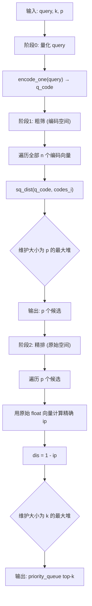
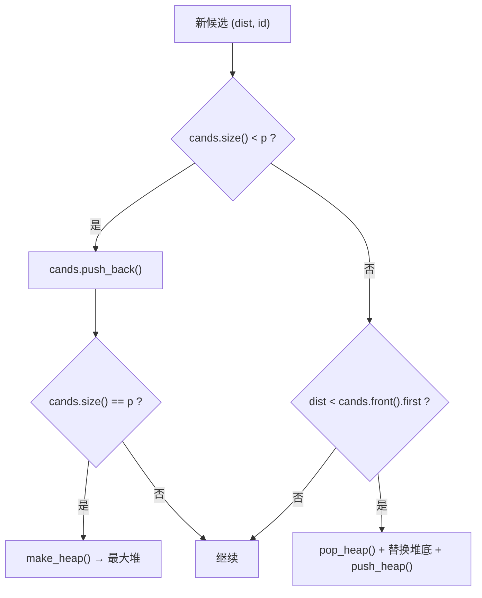
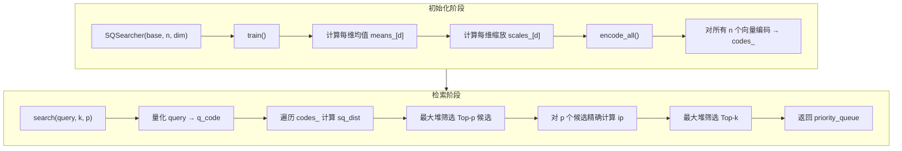
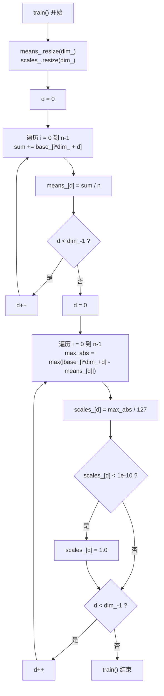
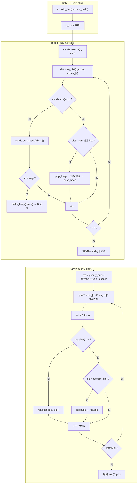
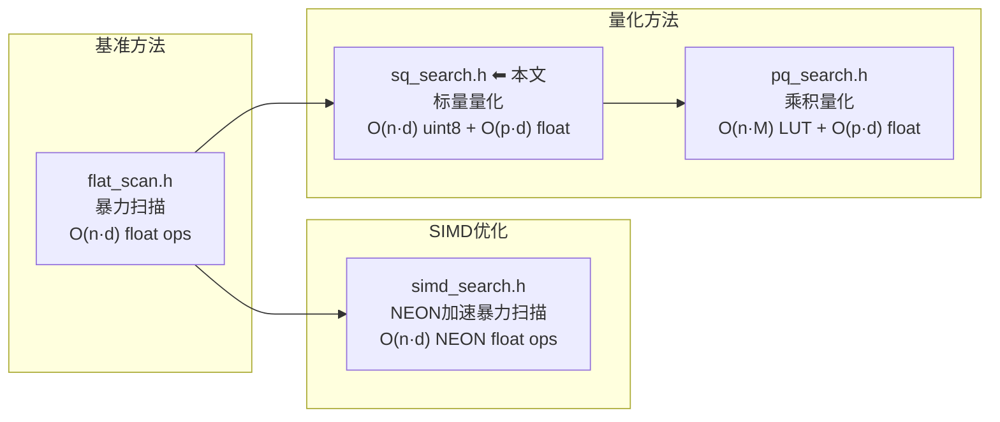
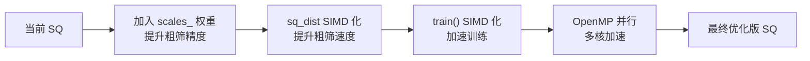

# SQSearcher 标量量化检索器 —— 深度源码分析

> **项目背景**：并行程序设计 Lab2 — SIMD 编程，基于 **DEEP100K** 数据集的近似最近邻检索（ANN）。  
> **关联文件**：[sq_search.h](sq_search.h) | flat_scan.h | simd_search.h | pq_search.h  
> **距离度量**：内积距离（Inner Product Distance），`dis = 1 - ip`

---

## 目录

1. [算法背景：标量量化 (Scalar Quantization)](#1-算法背景标量量化-scalar-quantization)
2. [类结构与成员变量](#2-类结构与成员变量)
3. [核心方法详解](#3-核心方法详解)
   - [3.1 `train()` — 训练量化参数](#31-train--训练量化参数)
   - [3.2 `encode_one()` — 单向量编码](#32-encode_one--单向量编码)
   - [3.3 `encode_all()` — 全库编码](#33-encode_all--全库编码)
   - [3.4 `sq_dist()` — 编码距离函数](#34-sq_dist--编码距离函数)
   - [3.5 `search()` — 两阶段检索](#35-search--两阶段检索)
4. [算法流程图](#4-算法流程图)
5. [复杂度分析](#5-复杂度分析)
6. [与同项目其他方法的对比](#6-与同项目其他方法的对比)
7. [潜在问题与改进方向](#7-潜在问题与改进方向)
8. [总结](#8-总结)

---

## 1. 算法背景：标量量化 (Scalar Quantization)

### 1.1 什么是标量量化

**标量量化（SQ）** 是最基础的向量量化方法。核心思想是：**对每一维独立进行量化**，将 32-bit 浮点数压缩为 8-bit 整数。

设有 $d$ 维向量 $\mathbf{x} = [x_1, x_2, \dots, x_d] \in \mathbb{R}^d$，量化过程为：

$$
\forall j \in [1, d]: \quad c_j = Q_j(x_j) = \text{round}\left(\frac{x_j - \mu_j}{\sigma_j} + 128\right)
$$

其中：
- $\mu_j$：第 $j$ 维的均值（用于中心化）
- $\sigma_j$：第 $j$ 维的缩放因子（由最大偏差除以 127 得到）
- $c_j \in [0, 255]$：量化后的 8-bit 编码值

### 1.2 为什么需要量化

| 维度 | 原始 (float) | 量化后 (uint8) | 收益 |
|------|-------------|---------------|------|
| 每维字节数 | 4 bytes | 1 byte | **4× 内存压缩** |
| 距离计算 | float 乘法 | int 乘法 | **更高吞吐** |
| 缓存效率 | 低 | 高 | **减少 Cache Miss** |

### 1.3 SQ vs PQ

本项目中同时实现了 **SQ（标量量化）** 和 **PQ（乘积量化）**：

| 特性 | SQ (sq_search.h) | PQ (pq_search.h) |
|------|-----------------|-----------------|
| 量化粒度 | 逐维独立 | 子空间聚类 |
| 训练复杂度 | $O(nd)$ | $O(M \cdot k \cdot n \cdot d_{sub} \cdot iter)$ |
| 编码精度 | 较低（无结构信息） | 较高（保留子空间结构） |
| 距离计算 | 简单点积 | 查表 + 累加 |
| 适用场景 | 快速原型、基线对比 | 高精度 ANN |

---

## 2. 类结构与成员变量

```cpp
class SQSearcher {
public:
    float* base_;                    // 原始数据库向量（行主序展平）
    size_t n_, dim_;                 // 向量数量 n，向量维度 dim
    std::vector<float> means_;       // 每维均值 μ_j          [dim_]
    std::vector<float> scales_;      // 每维缩放因子 σ_j       [dim_]
    std::vector<uint8_t> codes_;     // 量化编码表             [n_ × dim_]
};
```

### 2.1 内存布局

```
base_ (float*, n_ × dim_):
┌──────────────────────────────────────────────────┐
│ vec₀[0] vec₀[1] ... vec₀[d-1] │ vec₁[0] ...      │
│ ←──────── dim_ floats ──────→ │                   │
└──────────────────────────────────────────────────┘
  访问公式: base_[i * dim_ + d]  →  第 i 个向量的第 d 维

codes_ (uint8_t*, n_ × dim_):
┌──────────────────────────────────────────────────┐
│ code₀[0] code₀[1] ... code₀[d-1] │ code₁[0] ... │
│ ←──────── dim_ bytes ─────────→ │               │
└──────────────────────────────────────────────────┘
  访问公式: codes_[i * dim_ + d]  →  第 i 个编码的第 d 维
```

### 2.2 构造函数

```cpp
SQSearcher(float* base, size_t n, size_t dim)
    : base_(base), n_(n), dim_(dim) {}
```

> **注意**：构造函数仅保存指针和元信息，不执行训练或编码。调用方必须随后显式调用 `train()` 和 `encode_all()`。这种设计将初始化和计算分离，便于性能测量。

---

## 3. 核心方法详解

### 3.1 `train()` — 训练量化参数

```cpp
void train() {
    means_.resize(dim_);
    scales_.resize(dim_);

    // 阶段1：计算每维均值
    for (size_t d = 0; d < dim_; d++) {
        float sum = 0.0f;
        for (size_t i = 0; i < n_; i++) {
            sum += base_[i * dim_ + d];
        }
        means_[d] = sum / n_;
    }

    // 阶段2：计算每维缩放因子
    for (size_t d = 0; d < dim_; d++) {
        float max_abs = 0.0f;
        for (size_t i = 0; i < n_; i++) {
            float val = std::abs(base_[i * dim_ + d] - means_[d]);
            if (val > max_abs) max_abs = val;
        }
        scales_[d] = max_abs / 127.0f;
        if (scales_[d] < 1e-10f) scales_[d] = 1.0f;
    }
}
```

#### 3.1.1 阶段1：均值估计

对每一维 $d$，计算所有 $n$ 个样本在该维上的算术平均：

$$\mu_d = \frac{1}{n} \sum_{i=0}^{n-1} x_{i,d}$$

**作用**：数据中心化，使编码时的值以 128 为中心对称分布。

#### 3.1.2 阶段2：尺度估计

对每一维 $d$，计算去中心化后的最大绝对值偏差：

$$m_d = \max_{i \in [0, n)} |x_{i,d} - \mu_d|$$

然后得到缩放因子：

$$\sigma_d = \frac{m_d}{127}$$

**为什么是 127？**  
减去均值后，数据的理论范围是 $[-m_d, m_d]$。除以 $\sigma_d$ 后变为 $[-127, 127]$，再加上 128 的偏移后为 $[1, 255]$，正好落在 `uint8_t` 范围内而不会触及 0 和 255 的边界。

#### 3.1.3 边界保护

```cpp
if (scales_[d] < 1e-10f) scales_[d] = 1.0f;
```

若某一维所有值完全相同（$m_d \approx 0$），scale 会趋近于 0，导致编码时除以零。此处将其设为 1.0，等效于不做缩放。

#### 3.1.4 数值示例

假设某维数据：$\{10.0, 12.0, 8.0, 14.0, 6.0\}$

```
均值 μ = (10+12+8+14+6) / 5 = 10.0
偏差: |10-10|=0, |12-10|=2, |8-10|=2, |14-10|=4, |6-10|=4
max_abs = 4.0
scale  = 4.0 / 127 ≈ 0.0315

编码时: (10 - 10)/0.0315 + 128 = 128    → uint8: 128
        (14 - 10)/0.0315 + 128 ≈ 255    → uint8: 255
        (6  - 10)/0.0315 + 128 ≈ 1      → uint8: 1
```

---

### 3.2 `encode_one()` — 单向量编码

```cpp
void encode_one(const float* v, uint8_t* code) const {
    for (size_t d = 0; d < dim_; d++) {
        int val = (int)((v[d] - means_[d]) / scales_[d] + 128.0f);
        if (val < 0) val = 0;
        if (val > 255) val = 255;
        code[d] = (uint8_t)val;
    }
}
```

#### 3.2.1 量化公式

$$c_d = \text{clip}\left( \left\lfloor \frac{v_d - \mu_d}{\sigma_d} + 128 + 0.5 \right\rfloor,\ 0,\ 255 \right)$$

> 注：C++ 的 `float → int` 强制转换执行截断（truncation），而非四舍五入。`+128.0f` 隐含了 0.5 的四舍五入效果吗？**不**——这里只是偏移，真正的舍入依赖编译器行为。在正值范围 `[0, 255]` 内截断误差 ≤1。

#### 3.2.2 Clipping 的必要性

由于 $m_d$ 是训练集上的最大值，测试时的 query 或新数据可能超出训练范围，因此需要 clip 到 `[0, 255]`。

---

### 3.3 `encode_all()` — 全库编码

```cpp
void encode_all() {
    codes_.resize(n_ * dim_);
    for (size_t i = 0; i < n_; i++)
        encode_one(base_ + i * dim_, codes_.data() + i * dim_);
}
```

将全部 $n$ 个数据库向量编码为 `uint8_t`。编码后 `codes_` 占用 $n \times d$ 字节，相比原始 `base_` 的 $n \times d \times 4$ 字节，压缩比为 **4:1**。

---

### 3.4 `sq_dist()` — 编码距离函数

```cpp
float sq_dist(const uint8_t* a, const uint8_t* b) const {
    float ip = 0.0f;
    for (size_t d = 0; d < dim_; d++) {
        ip += (float)(a[d] - 128) * (float)(b[d] - 128);
    }
    return -ip;
}
```

#### 3.4.1 数学推导

原始内积（近似）：

$$\langle \mathbf{x}, \mathbf{y} \rangle = \sum_d x_d \cdot y_d$$

量化后，$x_d \approx \sigma_d (c_d^x - 128) + \mu_d$，因此：

$$\langle \mathbf{x}, \mathbf{y} \rangle \approx \sum_d \sigma_d^2 (c_d^x - 128)(c_d^y - 128) + \text{偏移项}$$

`s q_dist` 简化掉了 $\sigma_d^2$ 和偏移项，仅计算：

$$s(\mathbf{c}^x, \mathbf{c}^y) = \sum_d (c_d^x - 128)(c_d^y - 128)$$

返回 **负值**：`return -ip`，使得“高相似度”映射为“低距离值”，与 `search()` 中的堆逻辑兼容。

#### 3.4.2 命名说明

函数名 `sq_dist` 容易误解为 "Squared Euclidean Distance"，实际它是 **编码空间中的负相似度（近似负内积）**。

---

### 3.5 `search()` — 两阶段检索

```cpp
std::priority_queue<std::pair<float, uint32_t>> search(
    float* query, size_t k, size_t p)
```

这是整个类的核心，采用 **粗筛 + 精排** 两阶段策略：



#### 3.5.1 阶段1：粗筛（Encoding-space Filtering）

```cpp
std::vector<uint8_t> q_code(dim_);
encode_one(query, q_code.data());

std::vector<std::pair<float, uint32_t>> cands;
cands.reserve(p);
for (size_t i = 0; i < n_; i++) {
    float dist = sq_dist(q_code.data(), codes_.data() + i * dim_);
    // ... 维护大小为 p 的最大堆
}
```

**核心思路**：
1. 将 query 也量化到编码空间
2. 在整个数据库的编码上计算 `sq_dist`
3. 用大小为 $p$ 的最大堆（堆顶 = 最差距离）筛选 Top-$p$ 候选
4. 时间复杂度：$O(n \cdot d)$ 次 `uint8_t` 运算，无浮点开销

**堆操作细节**：



#### 3.5.2 阶段2：精排（Exact Re-ranking）

```cpp
std::priority_queue<std::pair<float, uint32_t>> res;
for (auto& c : cands) {
    float ip = 0.0f;
    const float* bv = base_ + c.second * dim_;
    for (size_t d = 0; d < dim_; d++) ip += bv[d] * query[d];
    float dis = 1.0f - ip;
    // ... 维护大小为 k 的最大堆
}
```

**核心思路**：
1. 仅对 $p$ 个候选向量进行精确 float 内积计算
2. 距离公式：$dis = 1 - \sum_d bv_d \cdot query_d$
3. 维护大小为 $k$ 的最大堆，返回最终 Top-$k$
4. 时间复杂度：$O(p \cdot d)$ 次 float 运算（$p \ll n$）

#### 3.5.3 为什么使用最大堆而非最小堆

```cpp
// 堆顶 = 当前集合中最差的（最大的距离值）
if (dist < cands.front().first) {  // 比最差的更好 → 替换
    std::pop_heap(...);
    cands.back() = {dist, i};
    std::push_heap(...);
}
```

这是经典的 **Top-K 维护模式**：用最大堆保留当前最优的 $k$ 个元素，堆顶是"门槛值"。新元素只需与堆顶比较即可 $O(\log k)$ 决定是否插入。

#### 3.5.4 参数 $p$ 的意义

$p$ 是粗筛阶段保留的候选数，$k \ll p \ll n$：

- $p$ 太小 → 可能遗漏真正近邻，召回率下降
- $p$ 太大 → 精排开销增大，失去加速意义
- 典型值：$p = k \times 10 \sim k \times 100$

---

## 4. 算法流程图

### 4.1 总体流程



### 4.2 `train()` 详细流程



### 4.3 `search()` 两阶段详细流程



---

## 5. 复杂度分析

### 5.1 时间复杂度

| 阶段 | 操作 | 时间复杂度 |
|------|------|-----------|
| `train()` 均值 | 遍历全部数据 | $O(n \cdot d)$ |
| `train()` 尺度 | 遍历全部数据 | $O(n \cdot d)$ |
| `encode_all()` | 逐维编码 | $O(n \cdot d)$ |
| `search()` 粗筛 | $n$ 次 `sq_dist`（uint8 运算） | $O(n \cdot d)$ |
| `search()` 精排 | $p$ 次精确内积（float 运算） | $O(p \cdot d)$ |
| **search() 总计** | | $O(n \cdot d + p \cdot d)$ |

对比 `flat_search`（暴力扫描）的 $O(n \cdot d)$ 全为 float 运算，SQ 的粗筛使用 uint8 运算，理论上可有 **2~4× 的常数加速**（取决于 CPU 的整数/浮点吞吐比和 SIMD 利用率）。

### 5.2 空间复杂度

| 数据结构 | 类型 | 大小 |
|----------|------|------|
| `base_`（外部） | `float` | $n \cdot d \cdot 4$ bytes |
| `means_` | `float` | $d \cdot 4$ bytes |
| `scales_` | `float` | $d \cdot 4$ bytes |
| `codes_` | `uint8_t` | $n \cdot d \cdot 1$ bytes |

**总附加内存**：$n \cdot d + 8d$ bytes，对 DEEP100K（$n=10^5, d=96$）约 **9.6 MB**。

---

## 6. 与同项目其他方法的对比

本项目中实现了四种检索方法，构成完整的实验对比矩阵：



### 6.1 详细对比

| 维度 | flat_scan | simd_search | sq_search | pq_search |
|------|-----------|-------------|-----------|-----------|
| **量化** | 无 | 无 | 逐维标量量化 | 子空间 K-Means |
| **SIMD** | 无 | ARM NEON | 无（可扩展） | ARM NEON + OpenMP |
| **训练** | 无需 | 无需 | $O(nd)$ | $O(Mknd_{sub})$ |
| **编码大小** | 原始 4B/维 | 原始 4B/维 | 1B/维 | $M \cdot 1B$ / 向量 |
| **粗筛距离** | — | — | `sq_dist`（简化内积） | LUT 查表 |
| **精度** | 精确（基准） | 精确 | 近似（有损） | 近似（有损） |
| **加速比(理论)** | 1× | 4~8× | 2~4× | 10~50× |

### 6.2 SQ 在项目中的定位

SQ 是这个实验的**中间基线**：
- 比 `flat_scan` 快（uint8 运算 + 候选剪枝）
- 比 `pq_search` 简单（无需迭代聚类训练）
- 比 `simd_search` 更省内存（4× 压缩）
- 精度介于精确方法和 PQ 之间

---

## 7. 潜在问题与改进方向

### 7.1 当前实现的问题

#### 问题 1：`sq_dist` 丢失了尺度信息

```cpp
// 当前实现：忽略 scales_
ip += (float)(a[d] - 128) * (float)(b[d] - 128);
```

正确的量化内积近似应为：

$$\langle x, y \rangle \approx \sum_d \sigma_d^2 (c_d^x - 128)(c_d^y - 128) + \mu_d \cdot (\dots)$$

忽略 $\sigma_d^2$ 会导致不同维度的重要性被均等化，**降低粗筛与精排的相关性**。

**改进建议**：

```cpp
float sq_dist(const uint8_t* a, const uint8_t* b) const {
    float ip = 0.0f;
    for (size_t d = 0; d < dim_; d++) {
        float da = (a[d] - 128) * scales_[d];
        float db = (b[d] - 128) * scales_[d];
        ip += da * db;  // 即 scales_[d]² * (a-128)(b-128)
    }
    return -ip;
}
```

#### 问题 2：`train()` 缺少 SIMD 加速

当前均值/尺度计算为标量循环，可以加入 SSE/AVX/NEON 指令加速。

#### 问题 3：`sq_dist` 缺少 SIMD 加速

对 `uint8_t` 的批量运算天然适合 SIMD：
- SSE：一次处理 16 个 uint8
- AVX2：一次处理 32 个 uint8
- NEON：一次处理 16 个 uint8

#### 问题 4：`search()` 无 OpenMP 并行

`pq_search.h` 已使用 `#pragma omp parallel for`，SQ 的 `sq_dist` 遍历是典型的 embarrassingly parallel 场景。

#### 问题 5：堆接口不一致

```cpp
// 粗筛阶段使用 vector + heap 算法
std::vector<std::pair<float, uint32_t>> cands;
// ...
std::make_heap(cands.begin(), cands.end());

// 精排阶段使用 priority_queue
std::priority_queue<std::pair<float, uint32_t>> res;
```

两种方式都可以，但混合使用降低可读性。建议统一为 `priority_queue`。

### 7.2 改进路线图



---

## 8. 总结

`sq_search.h` 实现了一个完整的**基于标量量化的近似最近邻检索器**，其核心设计思想是：

1. **逐维独立量化**：将 float 向量压缩为 uint8 编码，实现 4× 内存压缩
2. **数据中心化 + 尺度归一化**：通过均值和最大偏差估计量化参数
3. **两阶段检索**：
   - **粗筛**：在编码空间用 `uint8_t` 运算快速筛选 Top-$p$ 候选
   - **精排**：在原始 float 空间对 $p$ 个候选精确重排得到 Top-$k$
4. **最大堆维护 Top-K**：用堆结构高效维护候选集和结果集

这是一个经典且实用的 ANN 加速方案，作为实验中从"暴力扫描"到"乘积量化"的中间过渡基线，很好地展示了 **量化压缩 + 候选剪枝** 在近似检索中的价值。

---

*本文档由代码分析自动生成，项目路径：`lab2_SIMDprograming/src/sq_search.h`*